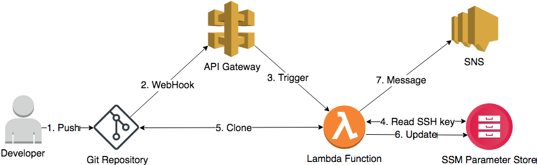

# git2params

A simple tool to publish and update your application configuration from a Git repo to the [SSM Parameter Store](http://docs.aws.amazon.com/systems-manager/latest/userguide/systems-manager-paramstore.html).

## Why?

SSM Parameter Store has several nice properties for configuration storage:

* Free

* Natively supports encryption via [KMS](https://aws.amazon.com/kms/)

* [IAM integration](http://docs.aws.amazon.com/systems-manager/latest/userguide/sysman-paramstore-access.html) for granular permissions management

## Features

* Painless (and serverless!) configurations management with SSM Parameter Store

* Format validation for `JSON` and `YML` files

## Requirements

Before you can use git2params, you need the following installed:

* [Docker](https://docs.docker.com/engine/installation/) for building the package. git2params depends on the mostly-\*nix-only [paramiko](http://www.paramiko.org/) SSH library. In order to avoid issues for Windows users, we use an Ubuntu-based docker container.

* [Serverless](https://serverless.com/framework/docs/providers/aws/guide/installation/) for creating and deploying a CloudFormation template (Lambda function, IAM permissions, etc).

* [AWS CLI](https://aws.amazon.com/cli) for uploading SSH keys to the SSM Parameter Store.

## How does it work?



1. Developer pushes changes to a git repo

2. The repo triggers a webhook to an API Gateway endpoint

3. API Gateway triggers a Lambda function, which:

    1. Reads the SSH key from SSM Parameter Store with path `$SYSTEM_PARAM_PREFIX/ssh-key`

    2. Clones the git repository locally

    3. Reads latest revision ID from SSM Parameter Store with path `$SYSTEM_PARAM_PREFIX/revision`:

    4. If revision ID does not exist in the store:

        1. Uploads all files from git to the store with path `$GIT_REPO_NAME/path/to/key`

    5. If revision ID exists:

        1. Take git diff of commits: *retreived revision ID* versus *latest revision ID*

        1. Uploads all added and modified files to the store

        1. Deletes all removed files from the store

4. Sends SNS message to the configured topic

All parametes are encryped with the default SSM key. For each parameter, the `Description` field contains the ID of the commit that last modified this file.

## Usage

1. Clone this repository

2. Set your configurations under the `custom.<environment>` key in `serverless.yml`:

        ####### Variables that need to be modified by the user
        prod:
            git_repo:
                name: # my_git_repo
                url:  # git@github.com:some_developer/my_git_repo.git
            aws:
                account_id: # 8888888888
                region: # us-east-1
                sns_topic: # my_sns_topic
            dry_run: "false"
        ######### End of modifications


    Multiple environments are supported. For example:
    
        ####### Variables that need to be modified by the user
        prod:
            git_repo:
                name: # my_git_repo
                url:  # git@github.com:some_developer/my_git_repo.git
            aws:
                account_id: # 8888888888
                region: # us-east-1
                sns_topic: # my_sns_topic
            dry_run: "false"
        testing:
            git_repo:
                name: # my_git_repo
                url:  # git@github.com:some_developer/my_git_repo.git
            aws:
                account_id: # 8888888888
                region: # us-east-1
                sns_topic: # my_sns_topic
            dry_run: "false"
        ######### End of modifications


    **If you don't know what you are doing, please do not modify any other value in `serverless.yml` as it can breake your deployment, IAM permissions, etc.**

3. Generate an SSH key with `ssh-keygen -t rsa -b 4096 -f ~/.ssh/my_git_repo`

4. Add the generated **public** key to your git repository as a read-only Deployment key. See [how to add deployment key](https://support.deployhq.com/articles/repositories) for Bitbucket/Github/Gitlab.

5. Upload the generated **private** key to the EC2 Parameters:

        aws ssm put-parameter \
            --name /git2params/repo_name/ssh-key \
            --value "$(cat ~/.ssh/my_git_repo)" \
            --overwrite \
            --type SecureString

    **The SSH key must be uploaded via CLI or API because the web UI breaks new lines, invaliditing the key.**

6. Deploy by running `make deploy ENVIRONMENT=prod`

7. If the deployment is successful, you'll see an API Gateway endpoint in the response:

        endpoints:
            POST - https://xxxxxxxx.execute-api.<region>.amazonaws.com/<environment>/params/update

8. Copy the endpoint and configure the webhook on your git repository (Webhook configurations for [GitHub](https://developer.github.com/webhooks/creating/), [BitBucket](https://confluence.atlassian.com/bitbucket/manage-webhooks-735643732.html#Managewebhooks-create_webhook) and [GitLab](https://docs.gitlab.com/ce/user/project/integrations/webhooks.html)).

**WARNING**: During first run if your git repository contains a lot of files (or you added many files in one push), function execution can fail with a timeout, without processing all the files. Therefore, it's recommended to execute first run locally with `make local ENVIRONMENT=prod` (IAM user with all the needed permissions required).

## SNS Notifications

* Currently there is no simple switch to disable SNS Notifications, so if you don't want to receive them you need to remove the following from `serverless.yml`:

    * `custom.<env>.aws.sns_topic`

    * `custom.sns_topic_arn`

    * `provider.environment.SNS_TOPIC_ARN`

    * IAM permissions for SNS topic:

```yml
- Effect: "Allow"
    Action:
    - "sns:Publish"
    Resource: "${self:custom.sns_topic_arn}"
```

* Each execution will send a message to the configured `SNS_TOPIC`

* Messages are JSON formatted and have the following schema:

```json
{
    "added":{
       "errors":[
          {
             "Commit":"9561d3a405c372eec509d15ad52d9cd77b9c3119",
             "Error":"YAML format problem: mapping values are not allowed here\n in \"<string>\", line 1, column 5:\n c: x: f:\n ^",
             "Time":"Fri Aug 25 14:04:06 2017",
             "Key":"/my-configs/test.yml",
             "Author":"user <user@example.com>"
          }
       ],
       "success":[
          {
             "Commit":"e9cd55dad2c5c0d77233b9c58e61fb6126949bcb",
             "Time":"Fri Aug 11 13:21:10 2017",
             "Key":"/my-configs/test",
             "Author":"user <user@example.com>"
          }
       ]
    },
    "modified":{
       "errors":[
          {
             "Commit":"ccf5d88ef6eb5940cd1d62f2e96b7b69e82354de",
             "Error":"JSON format problem: Expecting , delimiter: line 3 column 2 (char 16)",
             "Time":"Fri Aug 25 14:00:32 2017",
             "Key":"/my-configs/test.json",
             "Author":"user <user@example.com>"
          }
       ],
       "success":[
          {
             "Commit":"e9cd55dad2c5c0d77233b9c58e61fb6126949bcb",
             "Time":"Fri Aug 11 13:21:10 2017",
             "Key":"/my-configs/test",
             "Author":"user <user@example.com>"
          }
       ]
    },
    "removed":{
       "errors":[
          "/my-configs/key1",
          "/my-configs/key2"
       ],
       "success":[
          "/my-configs/key3",
          "/my-configs/key4"
       ]
    },
    "type":"git2params"
 }
```

## Known Limitations

* SSM Parameter Store has a maximum "path depth" of 5. So your keys can be named `/1/2/3/4/5/key`, but not `/1/2/3/4/5/6/key`.

* Currently only supports reading from the `master` branch.

* Currently only supports SSH git endpoints.

## TODO

* Better SNS messages in case of errors.

* Put configurations in a separate file, once [Serverless Issue #3882](https://github.com/serverless/serverless/issues/3882) fixed.

* Reading files from non-master branches.
